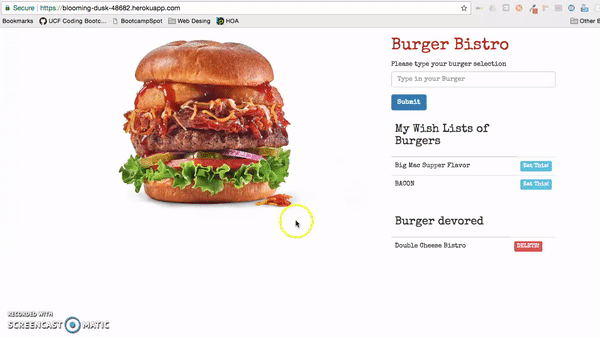
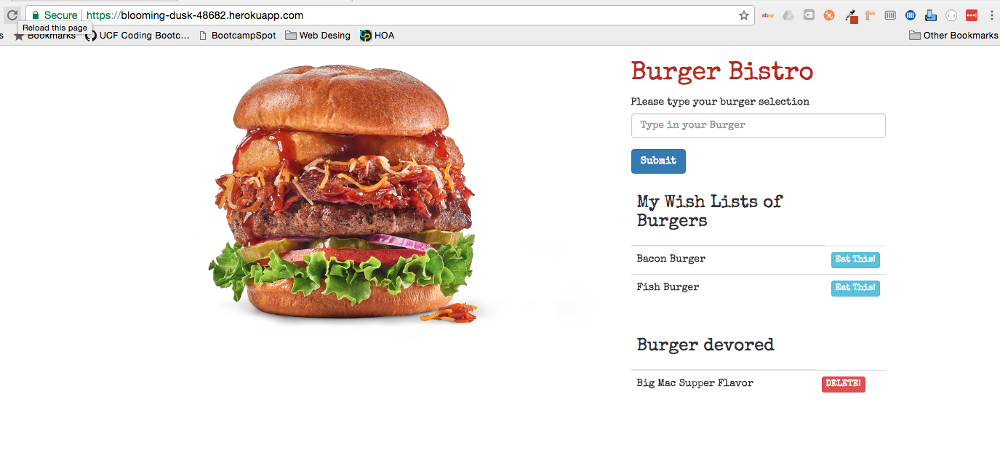

# Burger Homework NODE, Handlebars, ORM, Express
The following application or solution is oriented to be the first full-stack development solution.
This mean Frond End and Back End

##Technologies Uses:

Node.js
Express.js
Handlebars.
Mysql.
body-parse.
method-Override.
npm.

##Purpose of this application

The purpose of this application is to demonstrate the use of Node as a server. Also, all the development is ORM and MVC.

##Main Screen

